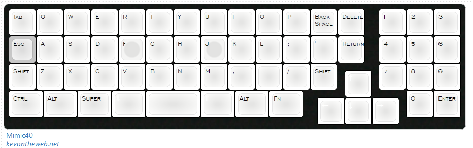
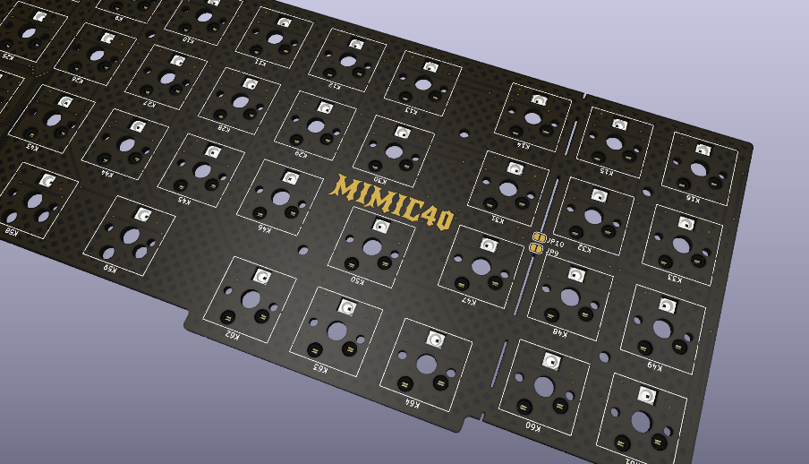
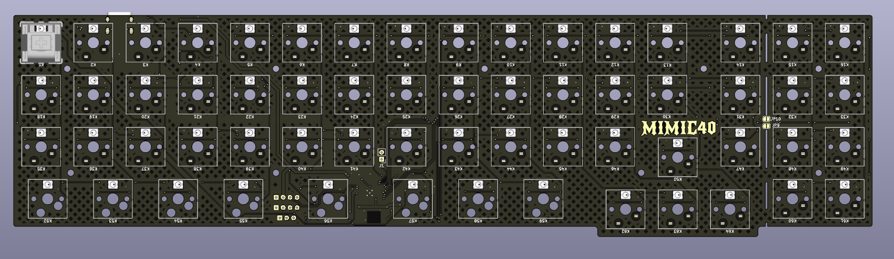
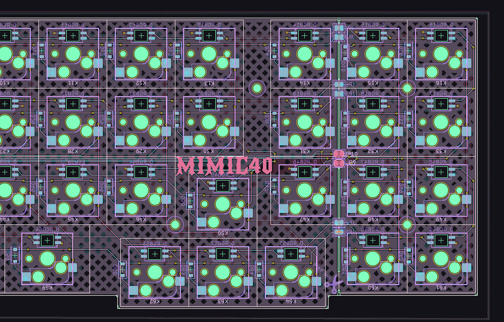
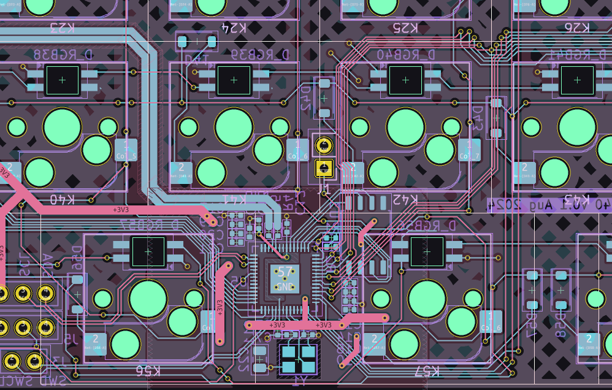

# Mimic40

A tiny ortho board that is pretending to be a fullsize. 

> I have not ordered any pcbs yet so consider these files *under development* until i can order some to test if they work.

<!--  -->

## tools used to build

1. [KLE](http://www.keyboard-layout-editor.com/##@_name=Mimic40&author=kevontheweb.net&background_name=PBT%20Black&style=background-image%2F:%20url('%2F%2Fbg%2F%2Fplastic%2F%2Fpbt-black.png')%2F%3B&$$hashKey=0BG%3B&radii=10px&switchMount=cherry&switchBrand=gateron&switchType=KS-3-Yellow&pcb:false&plate:true%3B&@_c=%23ffffff&p=DSA&f:4%3B&=Tab&=Q&=W&=E&=R&=T&=Y&=U&=I&=O&=P&=Back%20Space&=Delete&_x:0.5%3B&=1&=2&=3%3B&@_c=%23c7c7c7%3B&=Esc&_c=%23ffffff%3B&=A&=S&=D&_n:true%3B&=F&=G&=H&_n:true%3B&=J&=K&=L&=%2F%3B&='&=Return&_x:0.5%3B&=4&=5&=6%3B&@=Shift&=Z&=X&=C&=V&=B&=N&=M&=,&=.&=%2F%2F&=Shift&_x:1.5%3B&=7&=8&=9%3B&@_y:-0.75&x:12.25&t=%23ffffff%3B&=%2F&uarr%2F%3B%3B&@_y:-0.25&t=%23000000&w:1.25%3B&=Ctrl&_w:1.25%3B&=Alt&_w:1.25%3B&=Super&_t=%23ffffff&w:1.25%3B&=%2F&dArr%2F%3B&_t=%23000000&a:7&w:2%3B&=&_t=%23ffffff&a:4&w:1.25%3B&=%2F&uArr%2F%3B&_t=%23000000&w:1.25%3B&=Alt&_w:1.25%3B&=Fn&_x:3.75%3B&=0&=Enter%3B&@_y:-0.75&x:11.25&t=%23ffffff%3B&=%2F&larr%2F%3B&=%2F&darr%2F%3B&=%2F&rarr%2F)
2. [kicad](https://www.kicad.org/download/) EDA
5. [cherry mx datasheet](https://imgur.com/a/XMoHF)
<!-- x. [keyboard firmware builder](https://builder.mrkeebs.com/) for the matrix (if handwired) -->

These may be helpful for future in the design of a case

1. [builder.swillkb](builder.swillkb.com/) for the case
2. [ai03 plate generator](https://kbplate.ai03.com/)

## screenshots

## references

> this was in part inspired by  [This reddit post](https://www.reddit.com/r/MechanicalKeyboards/comments/ksto32/chocolate_bar/?utm_source=share&utm_medium=web2x&context=3).

# to do

- [x] define outer geometry
- [x] per key rgb
- [x] route rows and columns
- [x] switch to rp2040 based design (no dev board)
- [x] make plate cutout file (remember to add a 2u plate mount stabiliser)
- [ ] design a case (acrlic laser cut or possible 3d printed)
- [ ] order pcbs to test
- [ ] firmware
- [ ] take it from there
